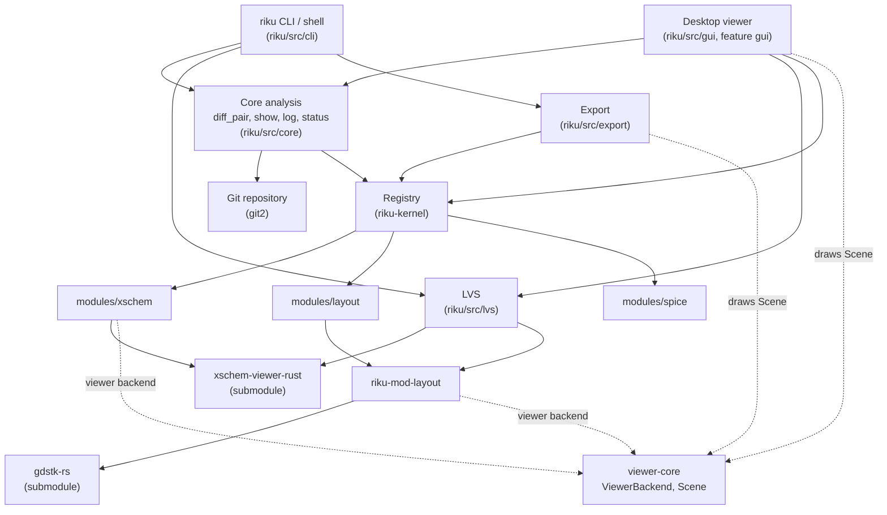

# Architecture

This page describes how Riku is put together: the crates, the contracts between them, how a diff flows through the code, and the rules that keep the design coherent.

On this page:

- [Overview](#overview)
- [Repository map](#repository-map)
- [Data flow](#data-flow)
- [Contracts](#contracts)
- [The diff flow](#the-diff-flow)
- [The layout engine](#the-layout-engine)
- [LVS](#lvs)
- [Internationalization](#internationalization)
- [Export and rendering](#export-and-rendering)
- [Threading model](#threading-model)
- [Project rules](#project-rules)

## Overview

Riku ships as a **single executable** (`riku`) that contains the command line, the interactive shell and the desktop viewer. Inside, it is a modular monolith built around a **microkernel**:

- A small core (`riku-kernel`) defines the vocabulary of changes and the `FormatModule` contract. It knows nothing about any file format.
- Each file format is a **module** that implements `FormatModule` and is registered in a `Registry`.
- Modules are linked **at compile time**, selected with Cargo features (`xschem`, `layout`, `spice`). There are no dynamically loaded plugins: Rust has no stable ABI, and a closed set of formats does not need one.
- The CLI, `log`, `status` and the viewer only talk to the `Registry`. They never name a format.

The viewer follows the same idea: `viewer-core` defines a format-neutral `ViewerBackend` that returns a `Scene`, so schematics and layouts are drawn by the same code path.

## Repository map

| Path | Role |
|---|---|
| `riku/` | The executable (`src/main.rs`) and its library (`src/lib.rs`). |
| `riku/src/cli/` | Clap definitions (`mod.rs`), dispatch, commands, the shell, `doctor`, `demo`, and text/JSON formatters (`format/`). |
| `riku/src/core/` | Git access (`git/`, on `git2`), the analysis pipeline (`analysis/`: `diff_pair`, `diff_set`, `show`, `log/`, `status/`, `summary/`, `parallel`), project configuration (`config.rs`, `.riku.toml`), path handling. |
| `riku/src/modules/` | Format modules: `xschem.rs` (+ `xschem_hier`, `xschem_view`, `xschem_pdk`), `layout.rs` (adapter to `riku-mod-layout`), `spice/` (ngspice `.raw` waveforms: `raw`, `compare`, `expr`, `derived`). `mod.rs::registry()` is the only place that lists them. |
| `riku/src/lvs.rs`, `riku/src/lvs/` | Layout-vs-schematic: `manual/` (`file`, `index`, `devices`, `check`, `suggest`, `session`), `cache.rs` (dependency-tracked result cache), `annotate.rs` (LVS in `log` and `status`). |
| `riku/src/export/` | Headless images: `svg.rs` (any viewer scene as SVG), `wave.rs` (waveform plots). |
| `riku/src/gui/` | The egui viewer (feature `gui`): app state, canvas, scene painter, history graph, LVS view, waveform view. |
| `riku/src/i18n.rs`, `riku/locales/` | User-visible strings (`en.yml`, `es.yml`), embedded at compile time. |
| `riku-kernel/` | Change types (`FileChange`, `Change`, `Element`, `Detail`), `FileFormat`, `FormatModule`, `Registry`, `DiffOptions`. |
| `riku-mod-layout/` | GDSII/OASIS/Magic: geometric diff, disk cache, PDK layer styles, Magic reader glue (`mag.rs`), devices (`devices/`), nets (`nets/`, with hierarchical extraction in `nets/hier/`), the viewer backend `GdsBackend`. |
| `viewer-core/` | Viewer contract: `ViewerBackend`, `Scene`/`RenderableScene`, `DrawElement`, `SceneIndex`, `Viewport`, `FileSource`/`DiffFiles`. |
| `external/gdstk/` | Submodule: `gdstk-rs`, Rust bindings to gdstk (C++) plus a native Magic `.mag` reader. Only `riku-mod-layout` depends on it. |
| `external/xschem-viewer-rust/` | Submodule: Xschem parser, semantics, netlister and viewer backend. Maintained upstream as a separate crate. |
| `tools/` | Scripts that are not part of the build: `demos/` (demo bundle generators), `palettes/` (generated PDK tables), `verify/` (checks against KLayout, Magic, Netgen and the viewer). See [development.md](development.md). |
| `examples/` | Sample data (`GDS/`, `SH/`) and the demo bundles embedded in the binary (`demos/*.bundle`). |
| `packaging/` | Install script, desktop entry and icon used by the release. |

The root `Cargo.toml` is a workspace (`viewer-core`, `riku-kernel`, `riku-mod-layout`, `riku`) with one `Cargo.lock` and one `target/`. `external/` is excluded from the workspace and enters as path dependencies.

## Data flow

`riku-kernel` and `viewer-core` sit at the bottom and depend on no format module or engine.

## Contracts

### `FormatModule` (riku-kernel)

Everything Riku can do with a format lives behind this trait (`riku-kernel/src/module.rs`):

| Method | Purpose |
|---|---|
| `info()` | Name, version, `FileFormat`, extensions and availability. Used by `riku doctor`. May be expensive (Xschem detects the PDK). |
| `extensions()` | Static list of extensions. This is what `Registry::for_path` checks for every path, so it must be cheap. |
| `detect(content)` | Recognize the format by signature, ignoring the extension. |
| `diff(before, after, path, opts)` | Changes between two versions as a `FileChange`. An empty side means the file did not exist. Non-fatal problems go into `warnings`. |
| `diff_with(..., files)` | Same, with access to the other files of each version (`DiffFiles`). Needed by formats split across files, such as Magic (one cell per file). Defaults to `diff`. |
| `viewer()` | Optional `ViewerBackend` for the viewer and for image export. |

`DiffOptions` carries the cosmetic area threshold, the waveform tolerance, whether the disk cache may be used, and computed waveform expressions. Each module reads only the options that apply to it.

The `Registry` resolves a module by path (`for_path`) or content (`detect`), lists comparable extensions (`extensions`) and openable ones (`openable`, which adds viewer-only extensions such as Xschem `.sym`).

### `ViewerBackend` and `Scene` (viewer-core)

`ViewerBackend` (`viewer-core/src/backend.rs`) is async and cancellable (`CancellationToken`):

- `load` / `load_with`: one version of a file.
- `load_entry`: a specific entry (a cell or sub-schematic) inside a file.
- `load_diff` / `load_diff_with`: two versions overlaid as a diff scene.

The `*_with` variants receive `DiffFiles`, the other files of each version. All non-essential methods have default implementations.

Backends return a `SceneHandle`, a `RenderableScene`. The plain `Scene` holds neutral `DrawElement`s (lines, rectangles, circles, polygons, text) plus optional overlays: layer paints, entries and links for navigation, change items, ghost geometry from the previous version, annotations, notices and a `NetProbe` for net highlighting. `Scene::build_index` builds a `SceneIndex` (size-bucketed grids, one-time triangulation and a coverage pyramid) so each frame only visits what is visible.

Waveforms are the exception: they are not planar, so the spice module has no `ViewerBackend` and the viewer draws them with its own view (`gui/wave_view.rs`).

## The diff flow

`riku/src/core/analysis/diff_pair.rs` is the **single path** for comparing one file between two versions. The CLI (`diff`, `show`, `status`, `log`) and the viewer all go through it.

- Each side is an `End`: a `Version` plus the path at that version (the old path for renames).
- `Version` is `Rev(&str)` (a commit, branch, tag or `HEAD~2`), `WorkTree` (the disk) or `Absent` (the file is new, deleted, or this is the parent of the root commit; compared against empty).
- `OnError` decides what happens with a Git error that is not about the file itself: `Propagate` (`diff`, `show` fail) or `InFile` (`status`, `log` record the error on that file and keep going).
- Other files of the same version reach the module through `FileSource`: `GitFiles` (blobs from the same commit, `riku/src/core/git/files.rs`) or `DiskFiles` (the working tree). Magic uses this to resolve sub-cells.

`log`, `show` and `status` fan out commits and files over the thread pool (`core/analysis/parallel.rs`), with one Git connection per thread, and keep the output in input order.

## The layout engine

`riku-mod-layout` is the only crate that uses `gdstk-rs`. `riku` sees it through `riku/src/modules/layout.rs`. Its public surface is what `riku` needs: `diff_layout_sides` (any format, with the files of each version), `diff_cell`, `GdsDiffReport`, `DiffCache`, `mag`, `pdk_tech`, `devices`, `nets` and `GdsBackend`.

### Geometry

- **Hierarchical fingerprints.** A Merkle tree over the hierarchy: two cells with the same fingerprint flatten to the same geometry and are skipped without flattening.
- **Twin instances.** Inside a cell that differs, instances identical in both versions cancel out. Only the rest is flattened, in chunks, never the whole chip at once.
- **Per-layer fingerprints** in canonical form (quantized vertices, no duplicates, counter-clockwise, starting from the smallest vertex). A layer with equal fingerprints is skipped without an XOR. Two polygons with the same 64-bit hash are treated as equal.
- **XOR only of what changed**, split with a quadtree when a layer has many polygons, because Clipper degrades badly on thousands of aligned rectangles. Splitting can change polygon counts at tile borders, never areas.
- **Disk cache** (`DiffCache`) for inputs over 1 MiB, keyed by the `riku-mod-layout` version, the bytes of each side and the parameters. It lives in `$RIKU_CACHE_DIR` or `<user cache>/riku/diff`, is size-capped (oldest entries go first) and treats unreadable entries as misses.

### Devices and nets

Electrical rules come from the PDK's Magic `.tech` file (`devices/rules.rs`), with a compiled copy in `devices/devices_generated.rs` for when the PDK is not installed (regenerated by `tools/palettes/gen_devices.py`). Regions are evaluated with gdstk's boolean and offset operations. `devices/` recognizes MOS transistors (model, W and L per finger); `nets/` builds connectivity, labels, resistors and the substrate, and reports opens, shorts and device changes. The viewer gets a `NetProbe` for hover and highlight.

### Hierarchical net extraction

Nets are extracted **per cell**, not on the flattened chip (`nets/hier/`):

- Every cell gets a content key (`NetKey`, a 128-bit Merkle hash that also covers labels, Magic ports, the rules, the unit, layer names, the inline threshold and the crate version).
- A cell's own geometry is extracted once and stored separately, so a parent rebuilt because a child changed does not re-extract its own shapes.
- Small sub-cells (below `RIKU_HIER_INLINE` flattened polygons, 256 by default) are inlined into their parent.
- Neighbourhoods between identical children are computed once; touching pairs are tested with a box grid.
- Results are memoized in memory (capped by `RIKU_NETS_MEM_MB`, 512 MB by default) and on disk in a `nets/` directory next to the diff cache (512 MB cap). They are reused across both sides of a diff, across the commits of a `log`, and across runs.
- A thread that needs a cell another thread is building keeps doing other `rayon` work while it waits, and builds it itself after 5 seconds instead of blocking.
- Changes are compared cell by cell. A cell above 2 million flattened polygons is compared only if it was already extracted, or when `RIKU_FULL_NETS=1` is set; otherwise its nets are compared in its sub-cells and a warning says so.

The reasoning behind these choices is in [design-notes.md](design-notes.md#hierarchical-net-extraction).

### Magic

`.mag` hierarchies are read natively by `gdstk-rs` (no Magic needed). `riku-mod-layout/src/mag.rs` collects a cell and its sub-cells from the same version, the PDK libraries and `$RIKU_MAG_PATH`, and picks lambda from the PDK (`$RIKU_MAG_LAMBDA` overrides it). Magic layer names map to PDK colors through `magic_layers_generated.rs` (from `tools/palettes/gen_magic_layers.py`). Layer colors for GDS come from the PDK `.lyp` (`palette_generated.rs`, from `gen_palettes.py`) with hand-curated tables taking precedence.

## LVS

`riku lvs` checks a layout against its schematic in one version (a commit or the working tree). Pairs come from `[[lvs]]` in `.riku.toml` or, by default, from files with the same stem (`ota-5t.sch` and `ota-5t.gds`).

- **Schematic netlist** from the netlister in `xschem-viewer-rust` (LVS mode), with PDK and project symbols of that version. Xschem itself is not needed.
- **Layout netlist** from `riku_mod_layout::nets`, with no external tools.
- **Manual links (default).** The designer states which schematic transistor is which layout transistor in `lvs/<cell>.toml`, a versioned file next to the design (`lvs/manual/file.rs`). A layout transistor is named by its model and a point on its gate in cell coordinates, so renumbering or moving the cell on the chip does not break links; a rigid move inside the cell is recovered automatically. From the links Riku derives parameter mismatches, shorts and opens (two links that contradict each other), pins, and how much is still unlinked (`check.rs`). `--suggest` adds links that follow without guessing (`suggest.rs`); `--update` rewrites positions after the layout moved.
- **Netgen (optional).** `--netgen` runs Netgen with the PDK's `setup.tcl` and reads its JSON report. It requires `netgen` on `PATH`.
- **Result cache** (`lvs/cache.rs`). A result is reused for a version only if every file the run read has the same content, files it looked for and did not find are still missing, and the environment fingerprint (PDK, Netgen, versions) is the same. All project files go through a recording `FileSource`, so dependencies are exact. Stored under `$RIKU_CACHE_DIR/lvs` or `<user cache>/riku/lvs`. See [design-notes.md](design-notes.md#lvs-result-cache-d10).
- **History.** `annotate.rs` adds LVS state to `riku log --lvs` (each commit against its first parent) and `riku status --lvs` (working tree against `HEAD`). See [design-notes.md](design-notes.md#lvs-in-log-and-status-d11-d12).

User documentation: [lvs.md](../lvs.md).

## Internationalization

All user-visible text of the CLI and the viewer lives in `riku/locales/<code>.yml` and is embedded at compile time with `rust-i18n`. Code asks for strings with `tr!("section.key", var = value)`. English is the default and the fallback for missing keys. The language is chosen by `RIKU_LANG`, then the choice saved in the viewer settings, then English. The list of languages comes from the files present. See [development.md](development.md#translations).

## Export and rendering

`riku/src/export/` produces images without a window or GPU, for `riku render` and `riku diff -f png|svg`. Schematics and layouts are loaded through the same `ViewerBackend` the viewer uses and drawn to SVG in the same order and colors as the GUI painter (`svg.rs`); waveforms are plotted by `wave.rs`. PNG is rasterized from the SVG with `resvg`. A current-thread `tokio` runtime drives the async backends.

## Threading model

- **One `rayon` pool per process**, sized by `--jobs` or `RIKU_JOBS` (default: available cores). All parallel work (log/status fan-out, fingerprints, XOR, net extraction, scene indexing) runs in it.
- **Memory is planned, not throttled.** Before running layout diffs in parallel, `core/analysis/parallel.rs` estimates each unit's cost from blob sizes and groups units into consecutive batches that fit in half of `MemAvailable`. A unit larger than the budget runs alone. No thread ever blocks on a semaphore or `Condvar` waiting for another `rayon` thread.
- **`tokio` only for viewer loading** (a small multi-threaded runtime in `gui/loader.rs`) and for driving backends in export.
- **The viewer thread only draws.** Loads, summaries and I/O run elsewhere, wake the UI with `request_repaint` and can be cancelled.
- **`gdstk-rs` types are `Send + Sync`** because everything is written while loading (`finish_load`); any new cache in the engine must be filled at load time or use `OnceLock`.
- After a large flatten the layout backend calls `malloc_trim` (glibc) to return memory to the OS.

## Project rules

1. **The core knows no formats.** `riku-kernel` depends on no module or engine; CI checks this with `cargo tree`. A module depends on the kernel, on `viewer-core` and on its engine, never on another module. Engines know nothing about Riku. Adding a format means a module in `riku/src/modules/` (or a `riku-mod-*` crate) and one line in `registry()`.
2. **Format-specific decisions belong to the module:** which detail keys are placement (`Detail::placement`), which extensions it opens (`extensions()`, `Registry::openable()`), which error means a corrupt file (`ViewerError::Corrupt`).
3. **The upstream `xschem-viewer-rust` crate is maintained separately; changes go upstream.** Riku does not patch it in place. Anything that touches it (symbol caching, the shape of `DrawElement`, the signature of `build_index`) is agreed with its maintainers.
4. **Contracts stay compatible.** Everything new in `viewer-core` and `FormatModule` has a default implementation; CI builds `xschem-viewer-rust` (feature `viewer-core-compat`) against the current `viewer-core`. The next load or diff parameter goes into a request struct with a defaulted method, not another `*_with` variant.
5. **One JSON shape.** All commands share one typed JSON form (schema v2 for diffs). An incompatible change bumps the schema version; a new optional field does not.
6. **Stable output.** A refactor does not change CLI text or JSON; compare against the previous binary. Layout areas are verified against KLayout.
7. **Layout cache keys include the `riku-mod-layout` version.** If the diff output changes, bump that crate's version.
8. **Threads.** One `rayon` pool per process (`--jobs`/`RIKU_JOBS`); `tokio` only for viewer loading. Never block a `rayon` thread waiting for another (semaphore, `Condvar`): plan memory up front in batches (`core/analysis/parallel.rs`, half of `MemAvailable`).
9. **Engine across threads.** `gdstk-rs` is `Send + Sync` because everything is written at load time (`finish_load`); a new engine cache is filled at load time or uses `OnceLock`.
10. **Magic.** Where Magic and KLayout disagree, Magic wins; Magic layouts are compared in Magic layers; the oracle for geometry is KLayout 0.30.12 or newer.
11. **The viewer thread only draws.** Loads, summaries and I/O run on other threads, wake the UI (`request_repaint`) and can be cancelled.
12. **Measure before optimizing**, and do not add what has not paid for itself: no R-tree/BVH (grids and the coverage pyramid are enough), no splitting of `GitRepository`, no dynamic plugins. `FileFormat` is a closed enum, which is fine for three formats.
