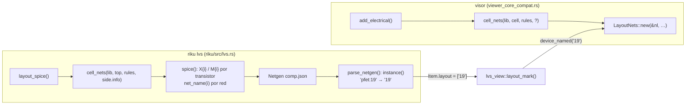

# Ronda 2: diseño

Cómo se cumple [`requirements.md`](requirements.md). Archivos revisados el 2026-10-03 sobre `main` (`1806094`).

## De dónde sale cada nombre



La sonda y la netlist que vio Netgen salen de la misma `Netlist` (misma función, misma celda). Los nombres coinciden si la sonda usa las mismas reglas que `spice()`: `net_name(i)` para las redes e `i` (posición en `nl.devices`) para los transistores. El `?` del visor es la diferencia a cerrar en D6b.

## D6. Lo que guarda `LayoutNets`

Hoy (`nets/probe.rs`): `types` (pedazos por tipo en una grilla), `names` (con `net_label`, para el tooltip) y `by_net` (los pedazos de cada red). Se agrega, todo armado en `LayoutNets::new` con la `Netlist` que ya recibe:

```rust
pub struct LayoutNets {
    types: Vec<TypePieces>,
    names: Vec<String>,              // tooltip: igual que hoy
    by_net: Vec<Vec<(usize, usize)>>,
    /// Nombre SPICE (`Netlist::net_name`) → red.
    spice_nets: HashMap<String, usize>,
    /// Por transistor (índice en `Netlist::devices`): su compuerta.
    gates: Vec<Vec<(f64, f64)>>,
    /// Por transistor: los transistores de su grupo de fingers (él incluido).
    group_of: Vec<Vec<usize>>,
    /// Por resistor (índice en `Netlist::resistors`): su cuerpo.
    bodies: Vec<Vec<(f64, f64)>>,
}
```

- `spice_nets`: nombre → **redes** (`HashMap<String, Vec<usize>>`). Dos redes separadas con la misma etiqueta salen en `spice()` con el mismo nombre, así que para Netgen son una: `net_named` devuelve los pedazos de las dos (cambio respecto a la primera versión de este diseño, que se quedaba con una y avisaba).
- `gates` y `bodies`: los puntos de `Device::gate` y `Resistor::body`, en unidades de la librería, como los pedazos de las redes (el mismo sistema que usa `at`).
- `group_of`: **`nets::parallel_groups(nl)`** (nueva, junto a `fingers`): mismo modelo, compuerta, cuerpo y par fuente/drenaje, **sin mirar L**. La primera versión usaba `fingers()` (que agrupa también por L) y el demo lo desmintió: Netgen da 8 dispositivos y `fingers()` 9, porque Netgen junta los rellenos de L = 0,5 µm y L = 1 µm de la misma rama (el `0` del demo: 6 compuertas, W = 19 µm en L = 0,5 + 2 µm en L = 1). Con `parallel_groups` salen los mismos 8, y cada uno se llama como su índice menor, que es el nombre que usa Netgen. `fingers()` no se toca.
- `names` sigue con `net_label` (`nets/diff.rs`): el tooltip conserva el nombre legible de hoy y no cambia (R6.6). `NetHit::name` de `net_named` lleva el nombre SPICE, que es el que se pidió.

**Prueba de no desfase (R8.4).** En la misma prueba: armar una `Netlist` a mano, escribir `spice()` y, por cada línea `X<i> d g s b …`, comprobar que `device_named("<i>")` existe y que `net_named(d)` y `net_named(g)` dan la red de esos terminales. Si alguien cambia cómo `spice()` nombra, la prueba falla.

## D6b. El visor extrae como el LVS

`add_electrical` llama `cell_nets(lib, cell, rules, None)`; `layout_spice` pasa `side.info` (lo que el lector de Magic sabe: qué etiquetas son `port`). Sin esa información, todas las etiquetas cuentan como pines y la red puede quedar nombrada por otra etiqueta. En GDS/OASIS `info` es `None` en los dos lados: el demo `ota` no lo nota.

Cambio: que la escena de Magic pase su `MagInfo` a `add_electrical` (el backend lo tiene al leer con `source::collect`; se sigue el camino hasta `build_scene`). Si en algún camino no está disponible, se deja `None` y se anota en el código por qué. Se verifica con un `.mag` de los ejemplos: los nombres de `riku lvs` aparecen en la sonda.

## D7. `net_named` y `device_named`

```rust
impl NetProbe for LayoutNets {
    fn net_named(&self, spice_name: &str) -> Option<NetHit> {
        let net = self.spice_nets.get(spice_name).copied().or_else(|| {
            let mut it = self.spice_nets.iter().filter(|(k, _)| k.eq_ignore_ascii_case(spice_name));
            match (it.next(), it.next()) { (Some((_, &n)), None) => Some(n), _ => None }
        })?;
        Some(NetHit { name: spice_name.to_string(), ..self.hit(net) })
    }

    fn device_named(&self, spice_name: &str) -> Option<NetHit> {
        match parse_device(spice_name)? {
            DeviceRef::Transistor(i) => {
                let group = self.group_of.get(i)?;
                Some(NetHit { name: spice_name.into(), outline: group.iter().map(|&d| self.gates[d].clone()).collect() })
            }
            DeviceRef::Resistor(i) => Some(NetHit { name: spice_name.into(), outline: vec![self.bodies.get(i)?.clone()] }),
        }
    }
}
```

`parse_device` (función suelta, con prueba de tabla):

| Entrada | Resultado |
|---|---|
| `19`, `X19`, `M19`, `x19`, `m19` | transistor 19 |
| `R3`, `XR3`, `r3`, `xr3` | resistor 3 |
| `X`, `19a`, `Q1`, `""` | `None` |

Netgen saca la `X` de las instancias de sub-circuito; los PDK abiertos usan sub-circuitos para los transistores, por eso llega `19`. Se aceptan las otras formas por si otro PDK o versión de Netgen las deja.

## D7b. El aviso de la lista

`lvs_view.layout_unplaced` se mantiene (sigue saliendo cuando la marca del layout queda vacía), con otro texto en `es.yml` y `en.yml`:

> No se encontró en el layout: puede ser una celda demasiado grande para calcular sus redes, un layout sin PDK conocido o un nombre que el layout no tiene. Solo se resalta el esquemático.

Y en `docs/lvs.md`, "Lado del layout" pasa a describir lo hecho (y "Lo que falta del layout" se borra).

## Riesgos

| Riesgo | Cómo se ve | Qué se hace |
|---|---|---|
| Netgen agrupa distinto que `fingers()` | se resaltan de más o de menos compuertas | R8.3: contar en el demo que las compuertas suman el W que da Netgen |
| La celda del LVS (`pair.cell`) no es la que abre el visor | nombres que no existen | la vista ya carga `pair.cell`; se confirma en el demo |
| Magic: etiquetas que no son pines | una red nombrada distinto en cada lado | D6b |
| Celdas de más de `MAX_POLYGONS` | el visor no calcula redes: no hay sonda | el aviso de D7b lo dice |

## Cómo se prueba

| Qué | Automática (`cargo test -p riku-mod-layout nets::probe`) | A mano |
|---|---|---|
| nombres de red | `net_named` exacto, sin mayúsculas, ambiguo, inexistente | `120ee0b`: Vout |
| dispositivos | `parse_device` (tabla); grupo de fingers; resistor; fuera de rango | `HEAD`: 19, 20, 7, 9, 0 |
| no desfase | nombres de `spice()` ⇄ sonda | — |
| GUI | — | captura de la vista de LVS con cada elección (XTest, como en la ronda 1) |
