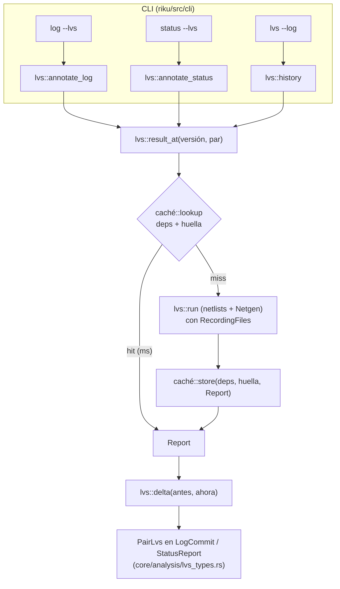

# Ronda 3: diseño

Cómo se cumple [`requirements.md`](requirements.md). Código revisado el 2026-10-04 sobre `main` (`549f3a5`). Nada de esto toca `xschem-viewer-rust`: se sigue llamando a `spice::netlist` y `tcleval::rc_vars` como hoy.

## Vista general



Una **versión** es un commit (`git2::Tree`) o el working tree. `result_at` es el único camino a un resultado: lo usan `--log`, `log --lvs` y `status --lvs`.

## D9. Discrepancias y delta

**Tipos sin features** en `riku/src/core/analysis/lvs_types.rs` (los ven `log` y `status`, que compilan sin `xschem`/`layout`):

```rust
pub enum Verdict { Match, PropertyErrors, Mismatch }          // se mueve desde lvs.rs
pub enum Transition { Broke, Worse, Better, Fixed }           // ídem
pub enum Discrepancy {
    Property { instance: String, param: String, schematic: String, layout: String },
    Nets { schematic: Vec<String>, layout: Vec<String> },
    Devices { schematic: Vec<String>, layout: Vec<String> },
    Pin { name: String, side: Side },                         // un pin de un solo lado
}
pub struct Delta { pub appeared: Vec<Discrepancy>, pub fixed: Vec<Discrepancy>, pub changed: Vec<(Discrepancy, Discrepancy)> }
pub enum LvsState { Done { verdict: Verdict }, Missing, Error { error: String } }
pub struct PairLvs {                                          // lo que va en log y status
    pub schematic: String, pub layout: String, pub cell: Option<String>,
    #[serde(flatten)] pub state: LvsState,
    pub transition: Option<Transition>,
    pub delta: Option<Delta>,                                 // None: sin padre con resultado
    pub discrepancies: Vec<Discrepancy>,                      // solo con --full
}
```

`lvs.rs` reexporta `Verdict` y `Transition` (los usan `lvs_view.rs` y el JSON de `riku lvs`, que no cambian).

**Clave** (`Discrepancy::key()`): `P:M3:w`, `N:Vout,Vp`, `D:M8`, `pin:Ib`. Para redes y dispositivos se usan los nombres del esquemático ordenados; si ese lado está vacío, `L:` y los del layout. Los nombres del layout (`19`) no sirven de clave: son índices que se corren al agregar un transistor.

**`delta(antes: &Comparison, ahora: &Comparison) -> Delta`** (en `lvs.rs`, con `Comparison`): mapas `clave → Discrepancy` de cada lado; apareció / se arregló por diferencia de claves; cambió si la clave está en los dos con otros valores. Ordenado por clave (R9.4).

**Error relativo** (R9.3), al mostrar: si los dos valores se leen como números (Netgen da `4`, `0.5`, `1e-06`), `(layout − esquemático) / esquemático`, con un decimal si es menor que 10 %. Si no, solo los valores.

## D10. Caché por dependencias

### Qué se registra en una corrida

`RecordingFiles<F: FileSource>` (en `lvs.rs`) envuelve el `DiskFiles` que hoy recibe el netlister y `layout_spice`:

```rust
impl FileSource for RecordingFiles<F> {
    fn read(&self, path: &str) -> Option<Vec<u8>> {
        let got = self.inner.read(path);
        let id = got.as_deref().map(|b| git2::Oid::hash_object(git2::ObjectType::Blob, b));
        self.seen.lock().insert(normalize(path), id);    // None: buscado y no encontrado
        got
    }
}
```

`run` además registra el esquemático y el layout, que hoy lee con `std::fs::read`. El id es el de Git para esos bytes, así que **para un commit coincide con el id del árbol** sin escribir nada.

Lo que **no** pasa por `FileSource` (los símbolos del PDK, que el netlister de Carlos lee de sus rutas; el `.tech`; Netgen) va en la **huella del entorno** (`EnvPrint`):

| Parte | De dónde |
|---|---|
| Riku, `spice::VERSION` | `CARGO_PKG_VERSION`, la constante del crate |
| PDK | nombre (`pdk_of`), carpeta, `.config/nodeinfo.json` si existe (open_pdks pone ahí el commit) |
| Netgen | contenido de `<pdk>_setup.tcl`; ruta, tamaño y fecha del ejecutable |
| Símbolos | contenido del `xschemrc` del PDK y la lista de rutas de símbolos (`render_options_for`) |

Se calcula por PDK una vez por proceso (memo). Leer el esquemático para saber el PDK es barato (un blob).

### Formato en disco

`<cache>/lvs/v2/<hash del par>/<hash de deps+huella>.json`:

```json
{ "env": "…", "deps": [["xschem/ota-5t.sch", "3f2a…"], ["xschem/sym/amp.sym", null], …], "report": { … } }
```

`v2/` separa la caché vieja (por carpetas), que no se lee más (R10.6). Por par se guardan hasta 200 entradas; al pasar, se borran las de fecha más vieja.

### Validar una entrada para una versión

```rust
trait Version { fn blob_id(&self, path: &str) -> Option<Oid>; }      // None: no está
// Commit: tree.get_path(path) → id del blob. Disco: Oid::hash_file(Blob, root/path).
```

Una entrada sirve si `env == huella actual` y, para cada dep, `version.blob_id(path) == id` (también `None == None`). Se prueban las entradas del par de la más nueva a la más vieja; la primera que sirve gana. Son búsquedas en el árbol o lecturas de unos pocos archivos: milisegundos (R10.5).

**Working tree con `core.autocrlf`:** el id del disco puede no ser el del blob. Solo produce un fallo de caché (se recalcula), nunca un resultado viejo.

### `result_at`

```rust
fn result_at(v: &dyn Version, repo: &Path, rev: Option<&str>, pair: &Pair, tools: &Tools, memo: &mut Memo) -> StepResult
```

1. El esquemático o el layout no están en `v` → `Missing`.
2. `memo` (por proceso) o caché → resultado.
3. Si no: `Tree::commit` (o `Tree::disk`), `run` con `RecordingFiles`, `store`.

`history`, `annotate_log` y `annotate_status` pasan a usar `result_at`. La `signature` por carpetas desaparece.

## D11. `riku log --lvs`

**CLI:** `--lvs` en `Log` (solo con `xschem`+`layout`). `run_log`, después de `log::analyze…`, llama a `lvs::annotate_log(&mut report, repo, pairs, level)`.

**`annotate_log`:**

1. Pares: los de `lvs::pairs(root, configured)` del working tree. Si el `log` tiene archivo o `--paths`, solo los pares cuyo esquemático o layout coincide.
2. Por commit del reporte y por par: `result_at(commit)`. Por su primer padre: `result_at(padre)`, que casi siempre ya está en `memo` porque es el commit siguiente de la lista. En el borde de `-n`, se calcula igual (una corrida más como mucho, por par y por borde).
3. `transition` con la misma regla que `mark_transitions` (que queda como función de dos veredictos). `delta` si los dos tienen resultado.
4. Se llena `LogCommit::lvs: Vec<PairLvs>`, con `#[serde(default, skip_serializing_if = "Vec::is_empty")]` (R11.5, sin subir `riku-log/v2`).
5. Netgen ausente: un aviso en `report.warnings` y ningún `lvs` (R11.6).

**Texto** (`log_text` y `log_graph`, en las líneas de detalle de cada commit). Ejemplos de lo esperado en el demo:

```text
● a603147  Wider PMOS load: M1, M2 W 2u -> 4u
│   xschem/ota-5t.sch  2 componentes modificados
│   LVS ota-5t: parámetros distintos  ← dejó de coincidir
│     + M1 w: esquemático 4, layout 2 (−50 %)
│     + M2 w: esquemático 4, layout 2 (−50 %)
● 120ee0b  Layout: route Vout to the left edge
│   layout/ota-5t.gds  …
│   LVS ota-5t: NO coinciden  ← empeoró
│     + redes sin pareja: Vout, Vp (layout: Vout)
● 02496a4 (narrow-input-pair)  Layout: trim the input pair diffusion to match
│   LVS ota-5t: parámetros distintos
│     ~ M3 w: esquemático 18, layout 20 → 19 (+5,6 %)
```

`+` apareció, `−` se arregló, `~` cambió, con los colores de los marcadores de `color.rs`. Niveles (R11.3): por defecto hasta 3 líneas y `… y N más`; `--detail` todas; `--full` también la lista completa. Sin cambio de veredicto ni delta, nada (R11.4); con `--detail`, `LVS ota-5t: parámetros distintos (sin cambios)`.

## D12. `riku status --lvs`

**CLI:** `--lvs` en `Status`. `run_status` llama a `lvs::annotate_status(&mut report, repo, pairs)` y, con `--lvs`, el resultado decide el código de salida.

**`annotate_status`:** por par, `result_at(HEAD)` y `result_at(disco)`. Si ningún dep del resultado de `HEAD` cambió en el disco, el del disco es el mismo y se reusa (R12.2). `StatusReport::lvs: Vec<PairStatusLvs>` con `head`, `worktree`, `transition` y `delta` (R12.5).

**Texto**, al final de `status`:

```text
LVS
  ota-5t      parámetros distintos → NO coinciden  ← empeoró
                + redes sin pareja: Vout, Vp (layout: Vout)
  inv         coincide, sin cambios
```

**Código de salida con `--lvs`** (R12.4):

| Caso | Salida |
|---|---|
| Algún par con `Broke` o `Worse` | 1 |
| Algún par con error (Netgen ausente, netlist rota) | 2 |
| Igual o mejor, sin discrepancias nuevas | 0 |
| Igual veredicto pero con `appeared` no vacío | 0 y aviso "aparecieron discrepancias nuevas" |

Un hook de pre-commit queda en una línea: `riku status --lvs -f json > /dev/null`. Se documenta en `cli.md`.

## D13. `riku lvs --log` con el delta

`history` arma `Step` con `result_at` y agrega `delta: Option<Delta>` (campo opcional en `riku-lvs-log/v1`). El texto usa las mismas líneas que `log --lvs`.

## D14. Decisiones y aviso de emparejamiento

- `lvs.md`, "Decisiones abiertas" → "Decisiones": las cuatro respuestas de `plan.md` con su porqué.
- `lvs::pairs`: cuando el nombre elige entre varios layouts (`amp.gds`, `amp.mag`), lo dice (`warnings` del reporte: "ota-5t.sch: se eligió layout/ota-5t.gds (también hay ota-5t.mag); se fija en .riku.toml").

## Riesgos

| Riesgo | Efecto | Qué se hace |
|---|---|---|
| Algo que el resultado usa y no se registra | resultado viejo | huella con todo lo que no pasa por `FileSource`; prueba R15.3; `RIKU_NO_CACHE` para descartar |
| `Oid::hash_file` del disco ≠ blob (`autocrlf`) | solo fallos de caché | aceptado |
| Muchas versiones sin caché (repos grandes, `-n 200`) | minutos | el texto avisa cuántas corridas nuevas hubo y cuánto tardaron; correr en paralelo, en otra ronda y después de medir |
| `Tree::commit` escribe todo el árbol | lento en repos grandes | solo cuando no hay caché; escribir solo lo leído queda para después (con la lista de deps se puede) |
| Mover `Verdict`/`Transition` cambia rutas | compila distinto | reexportarlos desde `lvs.rs` |

## Cómo se prueba

| Qué | Automática | A mano (demo `ota`) |
|---|---|---|
| claves y delta | tabla de `Comparison` → `Delta`; orden irrelevante; error relativo | — |
| caché | entrada válida e inválida contra un repo armado en la prueba (sin Netgen): cambia un dep, aparece uno que faltaba, cambia la huella | R15.3: símbolo en otra carpeta; segunda corrida sin Netgen |
| transiciones y salida de `status` | tabla veredicto × veredicto → transición → código | R15.2 |
| `log --lvs` | — | R15.1, con `--graph` y `-f json` |
